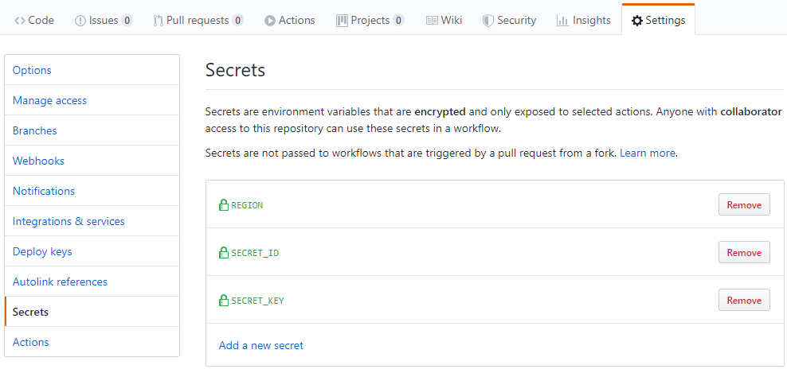

## 简介

该 [GitHub Action](https://help.github.com/cn/actions) 用于调用腾讯云
[TCCLI](https://github.com/TencentCloud/tencentcloud-cli)
工具。使用腾讯云命令行工具，您可以快速调用腾讯云 API 来管理您的腾讯云资源。您还可以基于腾讯云的命令行工具来做自动化和脚本处理，以更多样的方式进行组合和重用。

## workflow 示例

在目标仓库中创建 `.github/workflows/tccli.yml` 即可，文件名任意，配置参考如下：

```yaml
name: TCCLI

on:
  push:
    branches:
      - master

jobs:
  build-deploy:
    runs-on: ubuntu-18.04
    steps:
      - name: Running TCCLI
        uses: egcn/actions-tccli@v1
        with:
          args: version && help
          secret_id: ${{ secrets.SECRET_ID }}
          secret_key: ${{ secrets.SECRET_KEY }}
          region: ${{ secrets.REGION }}
          output: json
```

其中 `${{ secrets.SECRET_ID }}` 是调用在 Settings 配置的密钥，防止公开代码将权限密钥暴露。添加方式如下：



## 相关参数

以下参数均可参见 [TCCLI 配置文档](https://github.com/TencentCloud/tencentcloud-cli#%E9%85%8D%E7%BD%AEtccli)

| 参数 | 必要 | 备注 |
| --- | --- | --- |
| ARGS | 是 | tccli 命令参数，参见官方文档，多个命令用 ` && ` 隔开<br>如 `version && help`。 |
| SECRET_ID | 是 | 云 API 密钥 SecretId，前往 [API 密钥管理](https://console.cloud.tencent.com/cam/capi) 获取。 |
| SECRET_KEY | 是 | 云 API 密钥 SecretKey，前往 [API 密钥管理](https://console.cloud.tencent.com/cam/capi) 获取。 |
| REGION | 是 | 云产品地域，请前往对应云产品的 [API 文档](https://cloud.tencent.com/document/api) 获取可用的 region。例如云服务器的 [地域列表](https://cloud.tencent.com/document/api/213/15692#.E5.9C.B0.E5.9F.9F.E5.88.97.E8.A1.A8)。 |
| OUTPUT | 否 |  可选参数，请求回包输出格式，支持 [json table text] 三种格式，默认为 json。 |
